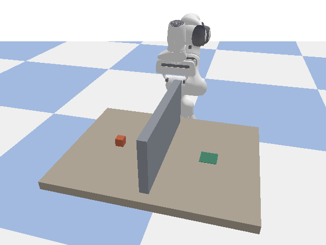
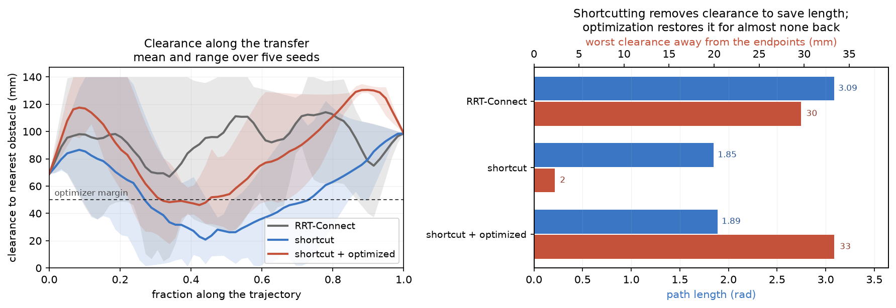

# panda-manipulation-planning

Motion planning for a 7-DOF Franka Panda in PyBullet. A classical sampling-based planner and a learned distance field with gradient-based trajectory optimization, compared on the same pick and place task.



The arm picks a block from one side of a divided table and places it on the other. The direct route is blocked, so the transfer has to lift the carried block over the wall. Each phase is its own planning query, and the grasped block is treated as part of the moving robot rather than as an obstacle, so the planner routes what the arm is carrying rather than only the arm.

## What is here

**RRT-Connect** grows trees from the start and the goal simultaneously, greedily connecting one to the other after each extension. Configuration space is the seven arm joint angles; sampling respects each joint's own limits, which matters because joint 3 runs entirely negative and joint 5 almost entirely positive.

**Shortcutting** splices collision-free straight lines into the result, repeatedly, keeping any splice that shortens the path.

**A learned signed distance field** predicts clearance from a joint configuration: distance to the nearest obstacle and the smallest separation between arm links that can touch. Two outputs rather than one, for reasons under Results. It is differentiable, which is the point: an optimizer needs to know which way to move, and a collision checker only answers yes or no.

**Gradient-based trajectory optimization** pushes every interior waypoint downhill against clearance, smoothness and deviation from the seed path, using gradients from the learned field. The smoothness term is CHOMP's, squared acceleration along the trajectory; what a learned field replaces is CHOMP's hand-built obstacle cost.

## Results



Five seeds on the transfer query, all twenty trajectories verified collision-free against exact geometry:

| method | path length (rad) | roughness | interior clearance |
| --- | --- | --- | --- |
| RRT-Connect | 2.34 | 0.0248 | 21.0 mm |
| shortcut | 1.67 | 0.0053 | 12.1 mm |
| optimized | 2.12 | 0.0071 | 48.7 mm |
| shortcut + optimized | 1.71 | 0.0039 | 46.8 mm |

Shortcutting halves the roughness and shortens the path by 29 percent, and makes clearance worse: it splices straight lines with no notion of margin, so a shortcut passing a millimetre from the wall is accepted as readily as one with room to spare.

Optimization nearly quadruples clearance for almost no length back. Running both keeps most of each.

Clearance is measured away from the endpoints. The start and goal are fixed IK solutions no method may move, so a whole-path minimum is bounded by whatever clearance they happen to have and reads identically for every method: an earlier version of this table reported the start configuration's clearance as though it were a result.

### The learned field

Trained on 200,000 configurations labelled from PyBullet's geometry queries, half of them sampled near the collision boundary by bisection since uniform sampling leaves that region thin.

| | model | constant predictor |
| --- | --- | --- |
| environment, mean error | 9.0 mm | 68.3 mm |
| environment, error near contact | 9.8 mm | 16.3 mm |
| environment, sign agreement near contact | 76.1% | 48.8% |
| self, mean error | 1.0 mm | 8.0 mm |
| self, sign agreement near contact | 98.8% | 91.2% |

Following the predicted gradient increases true clearance in 96.5 percent of configurations near contact, against 56.5 percent for a random direction.

Every metric is reported beside a predictor that ignores its input and returns the training median, because on a skewed target that baseline can score deceptively well. The environment head only beat it near contact past about 50,000 training samples.

## Limitations

**The learned field is a cost, not a collision checker.** At 76 percent boundary sign agreement it gets roughly one in four near-contact configurations wrong. That is workable for an optimizer precisely because the hinge penalty drives trajectories away from the boundary, so errors there stop mattering once the trajectory is not near it. Exact geometry decides validity, always, and every optimized trajectory is verified before it is returned.

**Smoothness is measured in joint space, not Cartesian space.** A trajectory can be smooth in joint angles while the end effector bobs, because the mapping between them is nonlinear. Measured on the transfer, optimization reduces the gripper's vertical range from 69 mm to 47 mm while tripling the number of vertical direction reversals, from two to six. The fix is differentiable forward kinematics so end effector acceleration can enter the cost directly, which is what cuRobo and similar optimizers do.

**Verification skips phases with intended contact.** The gripper touches the block throughout the grasp, so those phases are checked for the carried block against the wall but not for the arm against everything. An unintended collision during a grasp phase would go unnoticed. Distinguishing allowed contacts from disallowed ones per link is the proper fix.

**A better representation exists for the distance field.** Predicting a scalar from seven joint angles asks the network to internally solve forward kinematics and then compute distances to four separate bodies. cuRobo instead computes link positions analytically and queries a field indexed by 3D position, which is a far easier function to learn. Boundary error was still falling at 200,000 samples, so more data would help, but the representation is the real limit.

**GPU-accelerated planning is out of reach here.** cuRobo and Isaac Lab are CUDA-only and this was built on an AMD GPU, so everything runs on CPU.

## Requirements

Python 3.10+ and a CPU. No GPU needed.

## Setup

```bash
python3 -m venv .venv
source .venv/bin/activate
pip install -r requirements.txt
```

The pinned torch build is CPU-only and comes from PyTorch's own index:

```bash
pip install torch --index-url https://download.pytorch.org/whl/cpu
```

## Running it

Inspect the robot's joint structure, which is where the index conventions come from:

```bash
python examples/inspect_panda.py
```

Forward and inverse kinematics, including the redundancy of a 7-DOF arm reaching a 6-DOF pose:

```bash
python examples/run_kinematics_demo.py
```

Collision checking, including how it calibrates away the contacts that are structural:

```bash
python examples/run_collision_demo.py
```

Plan across the divided table, then compare planner, shortcutting and optimization:

```bash
python examples/run_scene_demo.py
python examples/run_shortcut_demo.py
python examples/run_optimizer_demo.py
```

The full pick and place, headless or watched:

```bash
python examples/run_pick_place.py
python examples/run_pick_place.py --gui
```

Regenerate the learned field from scratch, about six minutes to sample and nine to train:

```bash
python examples/build_sdf_dataset.py 200000
python examples/train_sdf.py
python examples/sdf_scaling.py        # how accuracy scales with data
```

Regenerate the README media:

```bash
python examples/generate_readme_media.py
```

## Tests

```bash
pip install -r requirements-dev.txt
pytest tests/ -q
```

Thirty tests, under three seconds. Most correspond to a bug that shipped briefly during development:

- IK returning identical solutions for every seed, because null space arguments whose length did not match the nine movable joints were silently ignored
- every configuration reporting a collision, because the robot base resting on the ground plane was counted as one
- the distance field saturating at 21 mm, because two arm links sit permanently that far apart and dominated a combined minimum
- paths through the wall, because extensions validated only the configuration they ended at and not the motion to reach it
- shortcutting producing blocked paths, because the splice checked the new middle segment but not the two joining segments it also created
- a carried block passing through the wall while the motion verified as collision-free, because grasping removed it from the obstacle list and put nothing in its place

## Structure

```text
src/
  panda.py            robot wrapper, kinematics, gripper
  collision.py        self and environment collision, attached objects
  scene.py            workspace scenes built from primitives
  rrt_connect.py      bidirectional sampling planner
  shortcut.py         path shortening by straight line splicing
  sdf_data.py         signed distance sampling and labelling
  sdf_model.py        the learned field, Fourier features, gradients
  sdf_train.py        training and evaluation against a baseline
  optimizer.py        gradient based trajectory optimization
  pick_place.py       phase sequencing, grasping, attachment
examples/
  inspect_panda.py            joint structure and limits
  run_kinematics_demo.py      forward and inverse kinematics
  run_collision_demo.py       collision checking and calibration
  run_scene_demo.py           how much each scene constrains the arm
  run_planner_demo.py         RRT-Connect with independent verification
  run_shortcut_demo.py        what shortcutting removes
  run_optimizer_demo.py       four way comparison
  run_pick_place.py           the full sequence
  build_sdf_dataset.py        sample and label training data
  train_sdf.py                train and check the field is usable
  sdf_scaling.py              accuracy against dataset size
  debug_sdf.py                which body supplies the minimum distance
  debug_splice.py             what a shortcut splice checks vs produces
  generate_readme_media.py    the animation and the figure
tests/
  test_planning.py            thirty tests
```

